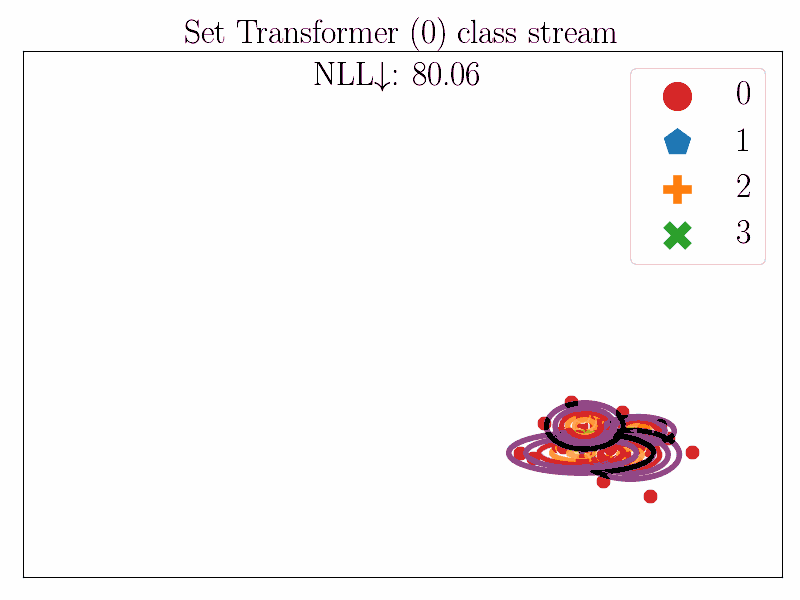

# Universal Mini-batch Consistent Set Encoders

> [**Scalable Set Encoding with Universal Mini-Batch Consistency and Unbiased Full Set Gradient Approximation**](https://arxiv.org/abs/2208.12401) **ICML 2023** <br>
> [Jeffrey Willette](https://github.com/jeffwillette)\*, [Seanie Lee](https://scholar.google.com/citations?user=zrZu6GkAAAAJ&hl=en)\*, [Bruno Andreis](https://scholar.google.com/citations?user=WzQ_v4IAAAAJ&hl=en&oi=ao), [Kenji Kawaguchi](https://scholar.google.com/citations?user=aLl3rYoAAAAJ&hl=en), [Juho Lee](https://scholar.google.com/citations?user=Py4URJUAAAAJ&hl=en&oi=ao), [Sung Ju Hwang](http://www.sungjuhwang.com/)

[arXiv](https://arxiv.org/abs/2208.12401)

This is the official repository for UMBC: **Scalable Set Encoding with Universal Mini-Batch Consistency and Unbiased Full Set Gradient Approximation** (ICML 2023).


# Motivating Example

In this task, the set encoder must take a set consisting of points in 2D space, and output the parameters of a Gaussian
mixture model which maximize the likelihood of the data. The sets comes in one of four different streams. The set
encoder must be able to accept the incoming streaming points and process them without storing any input points in
memory. Our UMBC model can accomplish this even when using non-MBC components such as self-attention which creates the
strongest overall model in this task.

<p align="center">
$$\huge {\color{green}✓} = \text{MBC model} \quad\quad {\color{red}✗} = \text{non-MBC model}$$
</p>

## UMBC (with Set Transformer) $\huge {\color{green}✓}$

<span>


</span>

## Set Transformer $\huge {\color{red}✗}$

<span>




</span>


# Experiment Commands and Datasets

Individual experiment code can be found in the respective {camelyon, celeba, mvn, and text} directories

### Celeba

[Dataset can be found here](https://mmlab.ie.cuhk.edu.hk/projects/CelebA.html)

```
cd celeba
bash run.sh "GPU" 100 umbc 128 true [train|test]
```

### Camelyon16

[Dataset can be found here in an S3 bucket](https://camelyon17.grand-challenge.org/Data/). Our preprocessing code can be
found in `data/preprocessing/camelyon.py`.

```
cd camelyon
python trainer.py \
    --gpus "0,1,2,3,4" \
    --mode [pretrain|pretrain-test|finetune|finetune-test] \
    --model sse-umbc \
    --k 64 \
    --attn-act softmax \
    --grad-set-size 256 
```

### Text

[Dataset download script [EURLEX57K] can be found here](https://github.com/amazon-science/efficient-longdoc-classification)

```
cd text
bash run.sh "0" 100 true
```

### MVN

MVN data is generated randomly every time the dataloader is asked for a new sample using the `sample()` method. Code can
be found in `data/toy_classification.py`

```
cd mvn
python trainer.py \
    --slot-type random \
    --mode [train|test] \
    --gpu "0" \
    --model sse-umbc \
    --heads 4 \
    --epochs 50 \
    --attn-act softmax \
    --grad-correction True \
    --train-set-size 512 \
    --grad-set-size 8 \

```

# Citation

```latex
@inproceedings{willette2023umbc,
  title={Scalable Set Encoding with Universal Mini-Batch Consistency and Unbiased Full Set Gradient Approximation},
  author={Jeffrey Willette, Seanie Lee, Bruno Andreis, Kenji Kawaguchi, Juho Lee, Sung Ju Hwang},
  booktitle={International Conference on Machine Learning (ICML) },
  year={2023}
}
```
 
# Layout

```
├── data
│   └── preprocessing
├── example-gifs
├── umbc
│   ├── camelyon
│   ├── celeba
│   ├── models
│   │   ├── diem
│   │   ├── layers
│   ├── mvn
│   └── text
└── utils
```

# Running tests

- Tests for Minibatch Consistency can be found in the test.py file
- To run the tests, navigate to the top level directory and run the following command

```
make test
```
